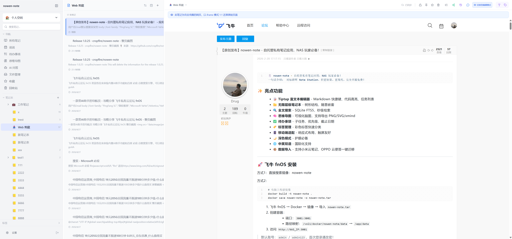
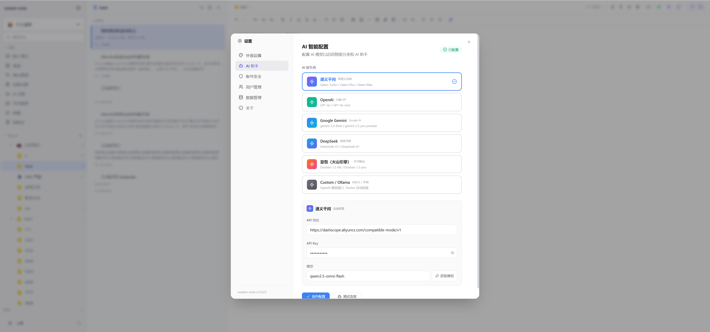
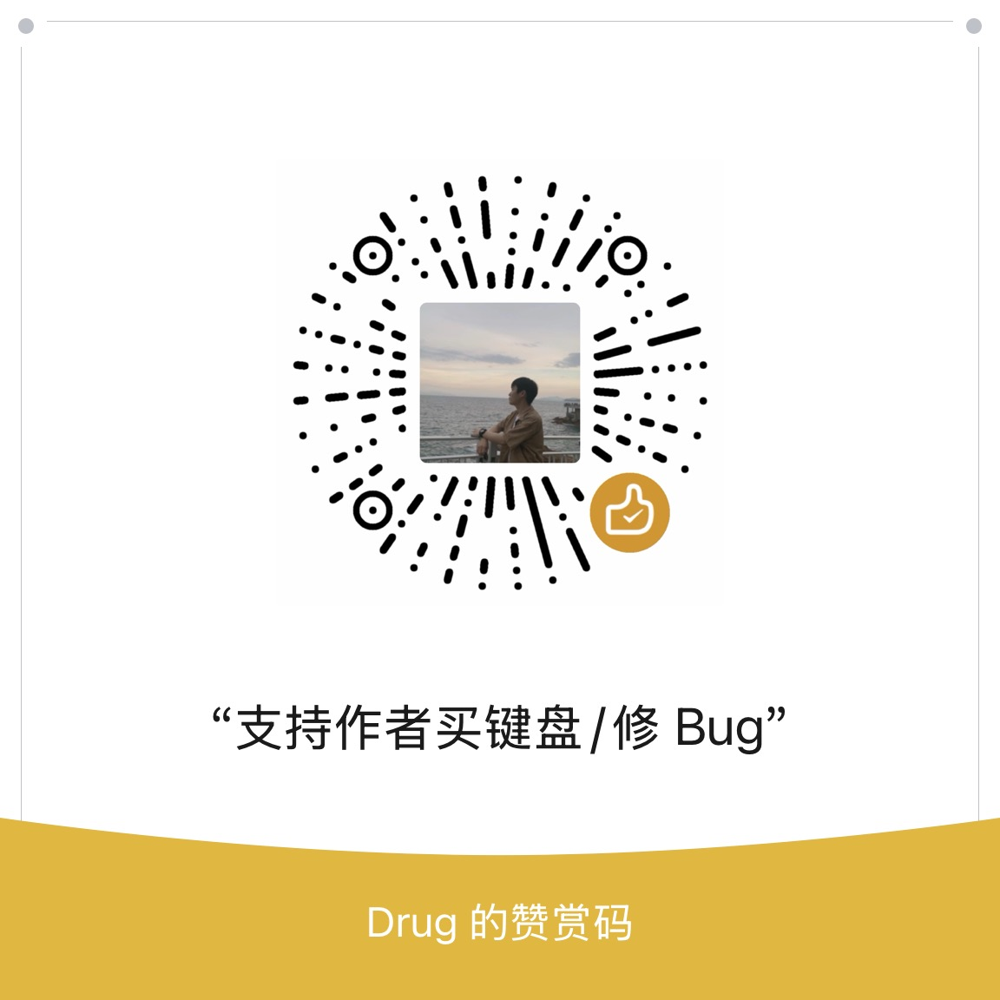

# nowen-note

> A self-hosted private knowledge base, inspired by Synology Note Station.
>
> 自托管的私有知识库。[中文 README](./README.md)

[](./LICENSE)
[](https://nodejs.org/)
[](./Dockerfile)

## Features

- **Dual editor engines**: Tiptap 3 (rich text) + CodeMirror 6 (Markdown), sharing AI, version history, comments and other capabilities
- **AI assistant**: Works with Qwen / OpenAI / Gemini / DeepSeek / Doubao / Ollama — writing assist, title generation, tag suggestion, RAG Q&A
- **Knowledge management**: Unlimited-depth notebooks, color tags, tasks, mind maps, moments, FTS5 full-text search
- **Collaboration & history**: Shared links (password / expiry / permission / comments), version rollback
- **Automation**: Sandboxed plugin system, Webhooks, audit log, scheduled auto-backup
- **Cross-platform**: Web / Electron (Win/macOS/Linux) / Android (Capacitor)
- **Developer ecosystem**: MCP Server, TypeScript SDK, CLI, browser clipper extension, OpenAPI 3.0 — see [`packages/`](./packages)

## Stack

React 18 · TypeScript · Vite 5 · Tiptap 3 · Tailwind · Hono 4 · SQLite(FTS5) · JWT · Electron 33 · Capacitor 8

## Screenshots

### Desktop

| AI writing assistant | AI provider settings |
| :---: | :---: |
|  |  |

### Mobile (Android / Capacitor)

| Sidebar | Note list | Editor |
| :---: | :---: | :---: |
|  |  |  |

## Quick Start

> Default admin: `admin` / `admin123`. Please change the password immediately after first login.

### Docker (recommended)

```bash
git clone https://github.com/cropflre/nowen-note.git
cd nowen-note
docker-compose up -d
```

Open `http://<your-ip>:3001`.

### Local development

Requires Node.js 20+.

```bash
git clone https://github.com/cropflre/nowen-note.git
cd nowen-note
npm run install:all
npm run dev:backend   # backend on :3001
npm run dev:frontend  # frontend on :5173
```

Open `http://localhost:5173`.

### Desktop / Mobile

```bash
npm run electron:dev      # Electron dev
npm run electron:build    # Package for Windows / macOS / Linux
```

For Android, download the APK directly from [Releases](https://github.com/cropflre/nowen-note/releases), or build it yourself with `npx cap sync android && npx cap open android`.

## Configuration

| Env var | Default | Description |
| --- | --- | --- |
| `PORT` | `3001` | Service port |
| `DB_PATH` | `/app/data/nowen-note.db` | Database file path |
| `OLLAMA_URL` | — | Local Ollama endpoint (optional) |

Data persistence: mount **`/app/data`** from the container to the host (not `/data`). The image declares `VOLUME ["/app/data"]`, so mainstream NAS panels will prefill this path.

Backup policy: auto-backups are written to `/app/data/backups` by default, sharing the same volume as the data. Following the 3-2-1 rule, it is strongly recommended to mount `/app/backups` to a separate disk and set `BACKUP_DIR=/app/backups` — see the inline notes in [`docker-compose.yml`](./docker-compose.yml).

## Documentation

- Deployment guide (Local / Docker / Desktop / Mobile / Synology / UGREEN / QNAP / fnOS / ZSpace / ARM64): [docs/deployment.md](./docs/deployment.md)
- ARM64 details: [docs/deploy-arm64.md](./docs/deploy-arm64.md)
- Email backup configuration: [docs/backup-email-smtp.md](./docs/backup-email-smtp.md)
- Editor mode switch: [docs/editor-mode-switch.md](./docs/editor-mode-switch.md)
- Privacy policy: [docs/PRIVACY.md](./docs/PRIVACY.md)
- OpenAPI: once running, visit `/api/openapi.json`

## Support

QQ group: `1093473044`

## Sponsor

If this project helps you, feel free to scan the QR code and buy the author a coffee.

<p align="center">
  
</p>

## License

[GPL-3.0](./LICENSE) — derivative works must also be distributed under GPL-3.0 and preserve the original copyright notice.
